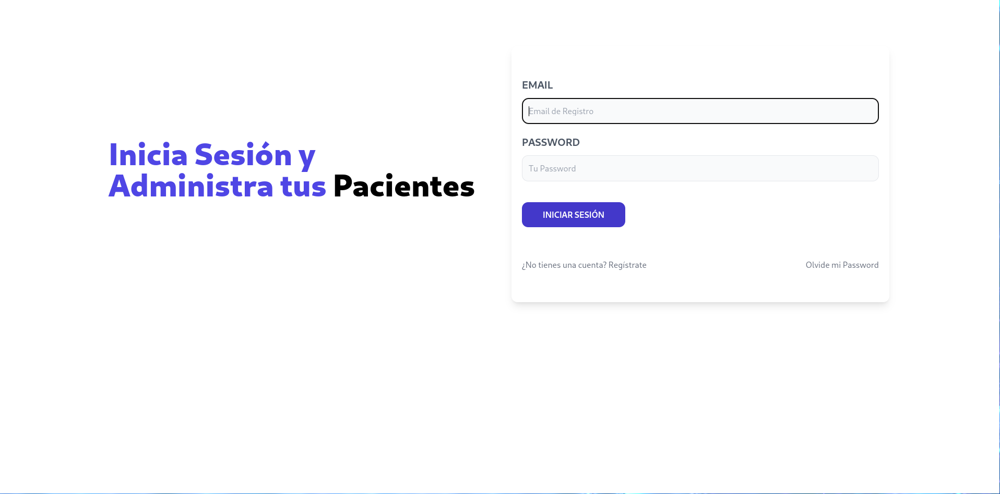
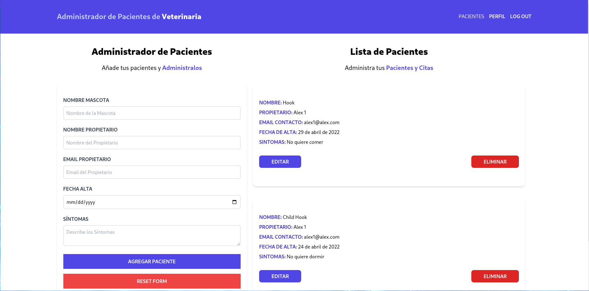
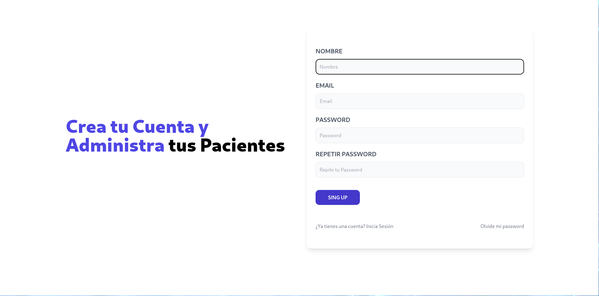

# APV - MERN - Front end

This is a basic fullstack project that includes the MERN stack.

## Features included in this project

- React.js
- React Router DOM v6
- Context API
- Vite
- tailwindcss

## Running the app

```
# install dependencies
npm i
yarn

# run in dev mode on port 3000
npm run dev
yarn dev


```

# What are the functionalities of this project?

## Authentication

This project uses the JWT authentication methodology. In each render of the AuthProvider the API is called to validate the JWT, if this is an invalid token, the user is disconnected and redirected to the login screen.

## State

The Global State of the app in the fronted is handled with Context API through an Authentication Provider.

## Sign Up

The user must register with an e-mail address that has not been used before. Once the account has been created, the user must confirm the e-mail address entered by clicking on a link that will be sent immediately.
This link will contain a one-time use token which, after validation, will be removed from the database so that it cannot be used again.

## View demo
[Demo](https://apv-mern-adrianlx.netlify.app/)

## Backend
[GitHub](https://github.com/adrianAlx/apv-mern-back)

### Screenshots




